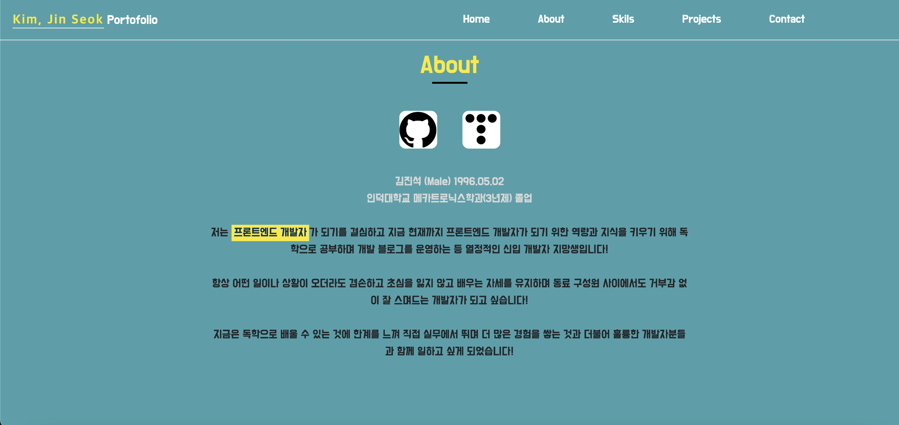
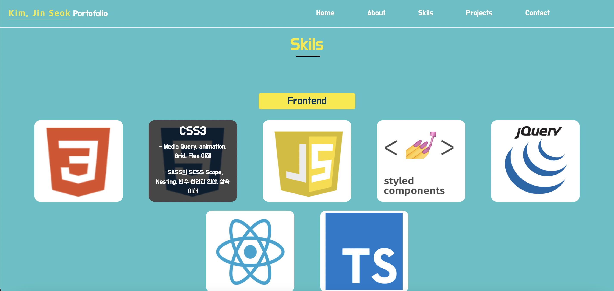
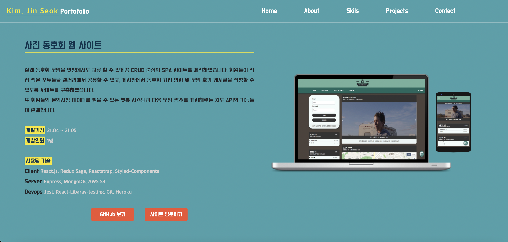
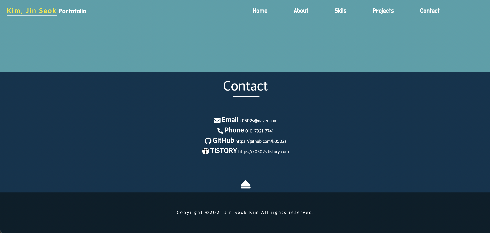
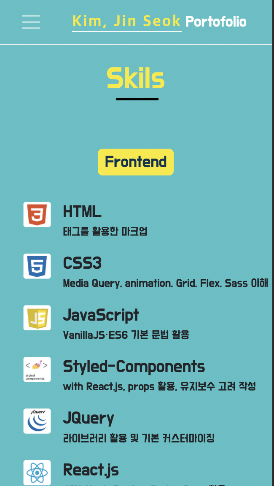
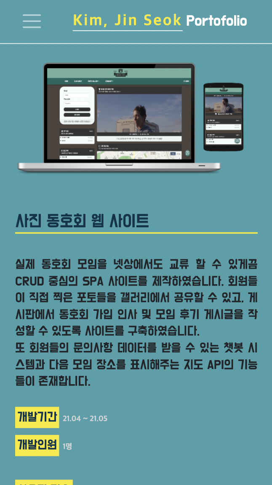

# Portfolio Site

  

#### [웹사이트 방문하기](https://k0502s.github.io/Kim-Jin-Seok-Portfolio)

## 프로젝트 소개

저에 대하여 간단명료하게 소개하기 위해 직관적인 정보를 전달하는 싱글 페이지를 제작하였습니다. React 환경에서 Styled-Components와 함께 스타일링 작업을 해보았습니다.

 

## 프로젝트 기능

* AOS API을 통한 페이지 스크롤에 반응하는 부드러운 애니메이션 효과.

* 모바일 디바이스에 대응한 반응형 CSS 스타일링.

 

## 웹사이트 화면

|             Home           |           About           |
| :-------------------------: | :---------------------------: |
|  |  |

|            Skils            |            Projects          |
| :---------------------------: | :--------------------------: |
|  |  |

|             Contact             |          Mobile Divce - 1         |          Mobile Divce - 2       |
| :---------------------------: |  :---------------------------: | :---------------------------: |
|  |  |   |

 

## 기술 스택

|               UI 라이브러리                |                      스타일링                      |
| :----------------------------------------: | :-----------------------------------------------: | 
|  |  |

 

|                오픈 API                  |
|:----------------------------------------------------: |
|  |

 

# 여러 기술을 사용하며 느낀점과 배운점들

## - UI 라이브러리 - React.js

 * 프로젝트를 진행하면서 UI 라이브러리로 [React.js](https://github.com/facebook/react)을 사용하였습니다. React.js을 사용한 이유로 처음으로 배운 UI 라이브러리이기도 하였으며 제일 많이 쓰이는 라이브러리라고 알고 있었기 때문이었습니다. 프로젝트를 통해 왜 React.js을 쓰는지 알게된 점이 가장 큰 의미가 있었습니다. React.js을 쓰면서 실제 실무에서 생상성이 확실히 좋을 것이라는 느낌을 받았습니다. 앞으로 React.js에 익숙해진다면 더욱 생상성의 시너지가 붙을 것 같다고도 생각하게 되었습니다. 특히 함수형 Hook을 사용하면서 React.js는 더욱 직관적인 개발을 할 수 있게 되었다고 생각하며 앞으로의 React.js 전망은 유망하다고 생각합니다.

 

## - 스타일링 - Styled-Components과 Reactstrap

* CSS 스타일링을 위해 [Styled-Components](https://github.com/styled-components/styled-components)을 사용하였습니다. 프로젝트를 진행하기 전에는 CSS는 CSS 그 자체로 혹은 Sass을 이용하여 스타일링을 하였지만 이번 프로젝트에서는 컴포넌트를 CSS-in-JS 방식으로 스타일링 하는 Styled-Components을 활용한 방식을 메인으로 사용하였습니다. 사실 처음에는 CSS-in-JS 방식이 낯설어 익숙한 CSS나 Sass을 쓸까 생각하기도 하였지만 이번 프로젝트로 Styled-Components을 통한 CSS-in-JS 방식에 익숙해지자 React.js 환경에서 보통 CSS나 Sass보다 Styled-Components이 훨씬 가독성이 좋으며 추후 유지보수 측면에서 우의를 차지하고 있다고 생각하게 되었습니다. 그만큼 사용할 수 있으면 매우 효율적이고 훌륭한 스킬이라고 알게되었습니다. 특히 React.js 환경에서 props을 활용한 CSS 스타일링은 개발하면서 정말 마음에든 스킬이었습니다.

* 더 높은 생상성을 위하여 CSS 라이브러리를 활용하기도 하였습니다. [Reactstrap](https://reactstrap.github.io)을 활용하였습니다. 레이아웃이라든지 간단한 Box 카드, Button 등등을 라이브러리를 통하여 더욱 빠르게 스타일링 할 수 있는 경험을 해보게 되었습니다. 특히 아직 부족한 실력에 레이아웃을 설계하는데 힘이 들었는데 라이브러리의 도움을 많이 받아 원활하게 원하는 view을 얻을 수 있었습니다. 특히 모바일 디바이스의 레이아웃 대응에도 매우 도움이 되었습니다.

 